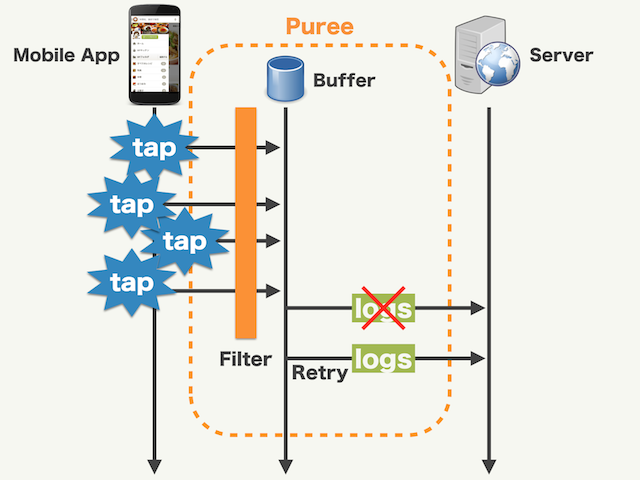

# puree-kmp

<div>
  
  
</div>


Puree-KMP is a structured logging library for Kotlin Multiplatform (KMP) applications, supporting both Android and iOS
platforms. It provides a flexible and extensible framework for capturing, processing, and routing logs to various
destinations.


## Features

- **Cross-Platform**: Works seamlessly on both Android and iOS
- **Filtering**: Log entries can be processed before being sent. You can add common parameters, do random sampling, ...
- **Buffering**: Log entries are stored in a buffer until it's time to send them.
- **Batching**: Multiple log entries are grouped and sent in one request.
- **Retrying**: Automatically retry to send after some backoff time if a transmission error occurred.



## Platform Support

| Platform | Support                       |
|----------|-------------------------------|
| Android  | :white_check_mark: Supported  |
| iOS      | :white_check_mark: Supported  | 
| JVM      | :black_square_button: Planing |
| Desktop  | :black_square_button: Planing |
| Web      | :x: Not Supported             |

## Installation

### Android

```kotlin
dependencies {
    implementation("com.cookpad.puree:puree-kmp:$latestVersion")
}
```

### iOS

Distributed through [Swift Package Manager](https://www.swift.org/documentation/package-manager/).
You can install directly from Xcode by specifying the URL for this repository.

## Usage

Note: If you want to know how to use the library in more detail, please take a look at the demo app. There are separate
versions for Android and iOS.

### 1. Define Log Classes

Create data classes that implement `PureeLog`:

```kotlin
// Kotlin
@Serializable
data class ClickLog(
    @SerialName("button_name")
    val buttonName: String,
) : PureeLog
```

```swift
// Swift
class ClickLog: PureeLog, Encodable {
    let buttonName: String
    
    init(buttonName: String) {
        self.buttonName = buttonName
    }
}
```

When creating log classes in swift, you need to use `class` instead of `struct`. This is due to Kotlin Native's specification that `struct` cannot conform to protocols written in KMP.

FYI: https://github.com/JetBrains/kotlin-native/issues/2975

### 2. Define filter / output

#### Filter

Implement the `PureeFilter` interface to create custom filters:

```kotlin
// Kotlin
class AddTimeFilter : PureeFilter {
    override fun applyFilter(log: JsonObject): JsonObject {
        buildJsonObject {
            put("time", System.currentTimeMillis())
            put("device_id", UUID.randomUUID().toString())
        }.also {
            return JsonObject(log + it)
        }
    }
}
```

```swift
// Swift
class AddTimeFilter: PureeFilter {
    func applyFilter(log: String) -> String? {
        guard var json = parseJSON(log) else { return log }
        json["time"] = ISO8601DateFormatter().string(from: Date())
        return stringifyJSON(json) ?? log
    }
}
```

#### Output

Implement the `PureeOutput` interface to output logs:

```kotlin
// Kotlin
class LogcatOutput : PureeOutput {
    override fun emit(log: JsonObject) {
        Log.d("Puree", log.toString())
    }
}
```

```swift
// Swift
class OSLogOutput: PureeOutput {
    func emit(log: String) {
        os_log("Puree: %s", log: osLogger, type: .debug, log)
    }
}
```

Extend `PureeBufferedOutput` for batch processing:

```kotlin
// Kotlin
class LogcatBufferedOutput(uniqueId: String) : PureeBufferedOutput(uniqueId) {
    init {
        flushInterval = 5.seconds
    }

    override fun emit(logs: List<JsonObject>, onSuccess: () -> Unit, onFailed: (Throwable) -> Unit) {
        // Process logs in batch
        Log.d("Puree", "Logs: $logs")
        onSuccess()
    }
}
```

```swift
// Swift
class OSLogBufferedOutput: PureeBufferedOutput {
    override init (uniqueId: String) {
        super.init(uniqueId: uniqueId)
        setFlushInterval(flushIntervalMillis: 5000)
    }

    override func emit(logs: [String], onSuccess: @escaping () -> Void, onFailed: @escaping (KotlinThrowable) -> Void) {
        os_log("Puree Buffered Logs: %s", log: osLogger, type: .debug, log)
        onSuccess()
    }
}
```

### 3. Configure Puree

Initialize Puree with filters and outputs:

```kotlin
// Kotlin
val logger = Puree(
    logStore = DefaultPureeLogStore("log.db"),
)
    .output(LogcatBufferedOutput("buffered"), ClickLog::class, MenuLog::class)
    .defaultOutput(LogcatOutput())
    .defaultFilter(AddTimeFilter())
    .build()
```

```swift
// Swift
private class DefaultPureeLogSerializer: PureeLogSerializer {
    func serialize(log: any PureeLog, platformClass: PlatformClass<any PureeLog>) -> String {
        return (log as? PureeLog & Encodable)?.encode() ?? ""
    }
}

private let pureeLogger: PureeLogger = {
    let logStore = PlatformDefaultPureeLogStore(dbName: "puree.db")
    let logSerializer = DefaultPureeLogSerializer()
    
    return Puree(logStore: logStore, logSerializer: logSerializer)
        .output(output: OSLogBufferedOutput(uniqueId: "buffered"), logTypes: [ClickLog.self, MenuLog.self])
        .defaultOutput(outputs: [OSLogOutput()].toKotlinArray())
        .defaultFilter(filters: [AddTimeFilter()].toKotlinArray())
        .build()
}()
```

Kotlin by default uses `kotlinx.serialization` to perform JSON serialization, so there is no need to prepare a special serializer. Of course, if you wish to use other serialization libraries (`Gson`, `Jackson`, etc.), you can prepare a custom serializer and register it with Puree.

Swift does not provide a default serializer, so you will need to provide your own serializer to encode PureeLog. In the above example, we use a class that conforms to the `Encodable` protocol to perform JSON serialization.

### 4. Send Logs

```kotlin
// Kotlin
inline fun <reified T : PureeLog> send(log: T) {
    logger?.send(log)
}
```

```swift
// Swift
func send<T: PureeLog & Encodable>(_ log: T) {
    pureeLogger.postLog(log: log, platformClass: PlatformClass(clazz: T.self))
}
```

It is important to note that log type information must be passed to Puree, which determines the Filter and Output to use based on the log type.
Therefore, be sure to use inline generics, etc. to pass log type information to Puree while retaining it.

### 5. Lifecycle Management

Puree automatically integrates with the application lifecycle (for Android only):

- Logs are buffered when the app is in the background
- Buffered logs are processed when the app returns to the foreground
- You can manually control this behavior with `logger.suspend()` and `logger.resume()`

## License

Please do read the [License](./LICENSE) before using and contributing.
